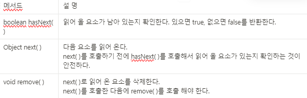
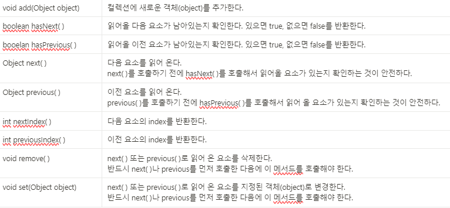

Iterator, ListIterator, Enumeration은 모두 컬렉션에 저장된 요소를 접근하는데 사용되는 
인터페이스이다. Enumeration은 Iterator의 구 버전 이며, ListIterator는 Iterator의 기능을 
향상 시킨 것이다.

# Iterator

Iterator 컬렉션 프레임워크에서는 컬렉션에 저장된 요소들을 읽어오는 방법을 표준화 하였다.
컬렉션에 저장된 각 요소에 접근하는 기능을 가진 Iterator인터페이스를 정의하고, Collection
인터페이스에는 ‘Iterator(Iterrator를 구현한 클래스의 인스턴스)’ 를 반환하는 iterator( )를 정의
하고 있다.

```java
public interface Iterator{
	boolean hasNext();
	Object next();
	void remove();
}

public interface Collection{
	//
	public Iterator iterator();
	//
}
```

iterator( )는 Collection 인터페이스에 정의된 메서드이므로 Collection인터페이스의 자손인 List와
Set에도 포함되어 있다. 그래서 List나 Set인터페이스를 구현하는 컬렉션은 iterator( )가 각 컬렉션의
특징에 알맞게 작성되어 있다.

컬렉션 클래스에 대해 iterator( )를 호출하여 Iterator를 얻은 다음 반복문, 주로 while문을 사용해서
컬렉션 클래스의 요소들을 읽어 올 수 있다.



```java
Collection collection = new ArrayList(); //다른 컬렉션으로 변경시 이 부분만 고치면 된다.
Iterator iterator = collection.iterator();

whlie(iterator.hasNext()){
	System.out.println(iterator.next());
}
```

ArrayList대신 Collection인터페이스를 구현한 다른 컬렉션 클래스에 대해서도 이와 동일한 코드를 
사용할 수 있다. 첫 줄에서 ArrayList대신 Collection인터페이스를 구현한 다른 컬렉션 클래스의 객체를 생성하도록 변경하기만 하면 된다.

Iterator를 이용해서 컬렉션의 요소를 읽어오는 방법을 표준화 했기 때문에 이처럼 코드의 재 사용성을 높히는 것이 가능한 것이다. 이처럼 공통 인터페이스를 정의해서 표준을 정의하고 구현하여 표준을 따르도록 함으로써 코드의 일관성을 유지하여 재 사용성을 극대화 하는 것이 객체 지향 프로그래밍의 중요한 목적 중의 하나 이다.

참조 변수의 타입을 ArrayList타입이 아니라 Collection 타입으로 한 이유는 Collection에 없고ArrayList에만 있는 메서드를 사용하는게 아니라면, Collection 타입의 참조 변수로  선언하는 것이 
좋다.

만일 Collection인터페이스를 구현한 다른 클래스, 예를 들어 LinkedList로 바꿔야 한다면 선언문
하나만 변경하면 나머지 코드는 검토하지 않아도 된다. 참조 변수 타입이 Collection이므로 Collection에 정의되지 않은 메서드는 사용되지 않았을 것이 확실하기 때문이다. 

만약 참조 변수 타입을 ArrayList로 했다면, Collection에 정의되지 않은 메서드를 호출했을 수 있기 
때문에 선언문 이후의 문장들을 검토해야 한다.

Map 인터페이스를 구현한 컬렉션 클래스는 키(key)와 값(value)을 쌍(pair)으로 저장하고 있기 때문에
iterator( )를 직접 호출할 수 없고, 그 대신 KeySet( )이나 entrySet( )과 같은 메서드를 통해서 키와 값을
각각 따로 Set의 형태로 얻어 온 후에 다시 iterator( )를 호출해야 Iterator를 얻을 수 있다.

```java
Map map = new HashMap( );

//

Iterator iterator = map.entrySet( ).iterator( );
```

Iterator iterator = map.entrySet( ).iterator( );는 아래의 두 문장을 하나로 합친 것이다.

```java
Set entrySet = map.entrySet();
Iterator iterator = entrySet.iterator();
```

1. map.entrySet( )의 실행 결과가 Set이므로
2. map.entrySet( )를 통해 얻은 Set인스턴스의 iterator( )를 호출해서 Iterator인스턴스를 얻는다.
3. 마지막으로 Iterator인스턴스의 참조가 iterator에 저장된다.

```java
StringBuffer stringbuffer = new StringBuffer();
sb.append("A");
sb.append("B");
sb.append("C");
```

위와 같은 코드를 아래와 같이 간단히 쓸 수 있는데 

```java
StringBuffer stringbuffer = new StringBugger();
stringbuffer.append("A").append("B").append("C");
```

그 이유는 바로 append메서드가 수행 결과로 StringBuffer를 리턴하기 때문이다. 
만일 void append(String str)과 같이 void를 리턴하도록 선언되어 있다면 위의 코드와 같이 쓸 수 없을 것이다. 

IteratorEx
```java
package ch07;

import java.util.ArrayList;
import java.util.Iterator;

public class IteratorEx1 {

	public static void main(String[] args) {
		ArrayList list = new ArrayList();
		list.add("1");
		list.add("2");
		list.add("3");
		list.add("4");
		list.add("5");
		
		Iterator interator = list.iterator();
		
		while(interator.hasNext()) {
			Object obj = interator.next();
			System.out.println(obj);
		}
	}
}
```

```java
1
2
3
4
5
```

List클래스들은 저장 순서를 유지하기 때문에 Iterator를 이용해서 읽어 온 결과 역시 저장 순서와 동일
하지만 Set클래스들은 각 요소간의 순서가 유지 되지 않기 때문에 Iterator를 이용해서 저장된 요소들을 읽어 와도 처음에 저장된 순서와 같지 않다.

# ListIterator

ListIterator는 Iterator를 상속받아서 기능을 추가한 것으로, 컬렉션의 요소에 접근할 때 Iterator는
단 방향으로만 이동할 수 있는 데 반해 ListIterator는 양방향으로의 이동이 가능하다.
하지만 ArrayList나 LinkedList와 같이 List인터페이스를 구현한 컬렉션에서만 사용할 수 있다.

ListIterator의 메서드



ListIteratorEx
```java
package ch07;

import java.util.ArrayList;
import java.util.ListIterator;

public class ListIteratorEx1 {

	public static void main(String[] args) {
		ArrayList arrayList = new ArrayList();
		arrayList.add("1");
		arrayList.add("2");
		arrayList.add("3");
		arrayList.add("4");
		arrayList.add("5");
		
		ListIterator listIterator = arrayList.listIterator();
		
		while (listIterator.hasNext()) {
			System.out.print(listIterator.next()); // 순방향
		}
		
		System.out.println();
		
		while (listIterator.hasPrevious()) {
			System.out.print(listIterator.previous()); // 역방향
		}
		
		System.out.println();
	}
}
```
```java
12345
54321
```

Iterator는 단 방향으로만 이동하기 때문에 컬렉션의 마지막 요소에 다다르면 더 이상 사용할 수 
없지만, ListIterator는 양방향으로 이동하기 때문에 각 요소 간의 이동이 자유롭다.
하지만 주의해야 할 점은 이동하기 전에 반드시 hasNext( )나 hasPrevious( )를 호출해서 이동할 수 있는지 확인해야 한다. 