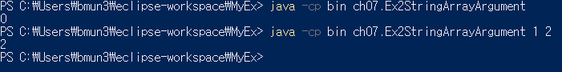

package와 Class선언한 후 public static void main(String[] args)를 사용하는데 프로그램을 실행할 때 접근 제어자를 선언한 main이라는 메소드가 호출되고 외부에서 입력받은 data 즉 매개변수(paramiter)를String타입의 배열 변수 args에 저장하고 참고하여 main메소드가 실행된다는 뜻이다.

외부에서 입력받은 data는 대부분 cmd(명령 프롬프트), 파워셀로 java명령어를 통한 data를 말하며 eclipse와 같은 개발환경도구(ide)를 사용하면 외부에서 data가 전달되는 경우가 드물어 String[] args
매개변수가 사용되는 상황은 거의 없을 뿐더러 매개변수의 값이 없을 경우 null로 초기화 된다.

하지만 그렇다고 public static void main 메소드에 매개변수로 String[] args가 선언되어있지 않다면 Java에서 규약된 표준(프로그램을 실행하기 위한 기본 형태)을 벗어나게 되어 프로그램 실행이 제한되어 동작하지 않는다.


```java
public class Ex2StringArrayArgument {

    public static void main(String[] args) {
          int argsLength = args.length;
          System.out.println(argsLength);
    }
}
```

```java
0
```

외부에서 data를 전달하여 args 배열 변수를 사용하기 위해서 사용하고 있는 프로젝트 폴더 마우스 우클릭 -> Show in -> program Exploer -> Shft 우클릭 -> 여기에 power shell 창 열기를 클릭하여 power shell
창을 열어 java명령어로 package와 Class파일을 입력해준다 data는 spaceBar로 띄어쓰기를 해주면 된다.



power shell를 사용해서 외부에서 eclipse로 MyEx 프로젝트, package에 있는 Ex2StringArrayArgument Class에 선언된 public static void main의 매개변수 (String[] args)에 data를 1, 2가 주어 졌을 때 args의 배열 변수에
index[0]은 1이 되고 index[1]은 2가 됨으로 args.lenth는 index가 2개 생성되었으니 2가 된다. 


이전에 사용했던 EnhancedFor문에서 String[] args를 제외한 main를 사용하면 오류가 나게된다.

```java
public class Ex1EnhancedFor {

    public static void main() {
        int[] intArray = {10, 20, 30, 40, 50, 60, 70};
        for(int ArrayResult : intArray) {
            System.out.println(ArrayResult);
        }
    }
}
```

```java
오류: ch07.Ex1EnhancedFor 클래스에서 기본 메소드를 찾을 수 없습니다. 다음 형식으로 기본 메소드를 정의하십시오.
   public static void main(String[] args)
또는 JavaFX 애플리케이션 클래스는 javafx.application.Application을(를) 확장해야 합니다.
```